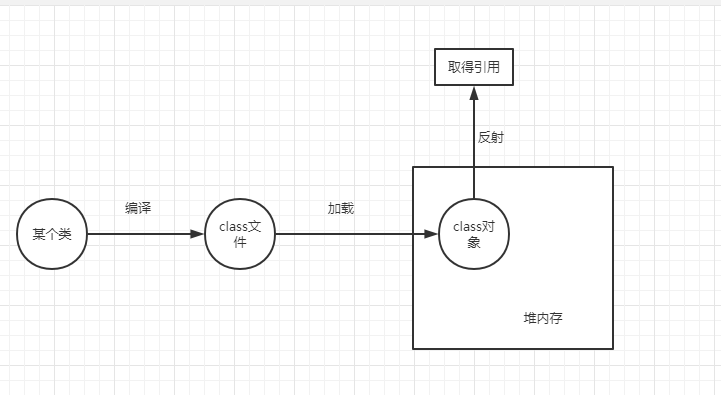

# 注解与反射

## 注解

- 写给编译器看的，能起到特殊作用
- 光有注解没用，要实现对注解的处理逻辑
- 内置注解
  - @Override
  - @Deprecated
  - @SuppressWarnings("all")

- 元注解，可注解注解 的注解
  - @Target   在哪里可以起作用
  - @Retention   到哪个阶段还可以起作用
  - @Documented  是否将注解生成在JavaDoc中
  - @Inherited    子类是否可以继承父类的注解

## 反射

- 取得class对象的方法
  - 已知全类名：Class.forName()   类.class
  - 已有对象：对象.getClass()

- 可以**利用反射获取注解的参数**