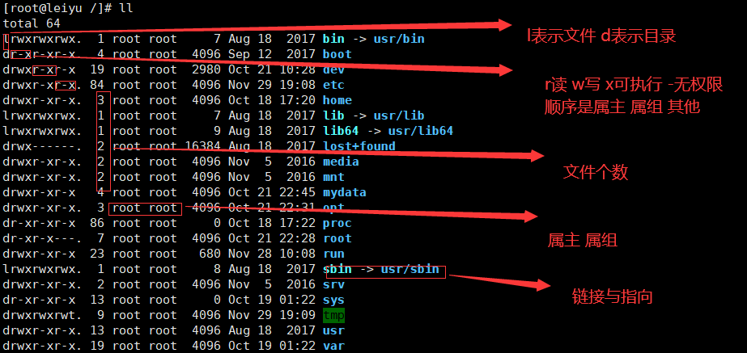

## 基本命令

### 开关机

- sync 将数据从内存写入磁盘
- shutdown -h now 立马关机    -h 10    10分钟后关机
- reboot 重启

### 文件操作

- ls -a 显示所有文件**包括隐藏文件** ，-l 显示详细信息 ，**白色代表文件，蓝色代表文件夹**

- mkdir 创建目录   -p 创建多层级目录

- rmdir 删除空目录  -p 删除多层级目录，**需要把目录写完整**

- cp 复制 -r 复制文件夹

- mv 移动 -u 只替换更新过的文件 -f 强制     、    重命名

- rm 删除 -r 多级 -f 强制

### 文件内容查看

- 进入网络配置目录 cd etc/sysconfig/network-scripts

- 查看文件

  - cat 查看

  - nl 查看，显示行号

  - less 查看，可上下翻，空格直接翻页，q退出，:f查看当前行，/关键字 向下查找，？关键字 向下查找，n寻找下一个，N寻找上一个

    

### 网络配置

- ifconfig  查看网络配置

- 端口配置

  - systemctl restart firewalld.service   重启防火墙
  - systemctl stop firewalld.service   关闭防火墙
  - firewall-cmd --list-ports    查看开放的端口
  - firewall-cmd --zone=public --add-port=xx/tcp(udp) --permanent    添加端口
  - **开启端口后要重启防火墙才能生效**
  - **阿里云还需要在管理平台开启安全组**

  

## 文件系统

- **一切皆文件**

- 数状结构

- 根目录下的一些文件夹的用途
  - bin 存放二进制命令
  - home 用户主目录
  - **etc 配置文件**
  - mnt 挂载别的文件系统
  - media 媒体驱动
  - lib 动态链接库
  - opt 额外软件的安装目录，如OracleDB
  - root 系统管理员的主目录，**root权限下的 ~**
  - usr 类似windows的 program files文件夹
  - tmp 临时文件，用完就丢
  - var 经常修改的文件，如日志文件
  - **www 存放服务器相关的资源**

- 文件属性查看

  

  - ==l表示链接，写错了==     -表示文件

- ==文件属性的修改==

- ==软链接与硬链接==

  

  

## Vim编辑器

## 账号管理

## 用户组管理

## 磁盘管理

## 进程管理

## 软件安装

- rpm安装JDK

  - 先要有一个JDK8的rpm包，可以用xFTP从windows本机移到Linux服务器

  - 然后检查是否已经有java，java -version 查看

  - rpm -e --nodeps 强制删除 如果有的话

  - rpm -ivh jdk的rpm包名     安装jdk

    - 会装在/usr/java 下

  - 用rpm安装不需要配置环境变量

  - 跑一个jar包

    - 先在本地试一下看能不能跑，能不能正常使用

    - 看防火墙端口是否开启，没有的话开启然后重启防火墙，阿里云还要配置安全组规则 
- rpm删除JDK
  - rpm -qa|grep jdk      过滤jdk的信息
  - rpm -e --nodeps  刚刚得到的jdk信息            强制删除jdk 如果有的话
- 解压缩安装Tomcat
  - SSM项目是以war包的形式部署到Tomcat上的
  - 先下载Tomcat的tar.gz包，上传到linux文件夹
  - 然后 tar -zxvf  压缩包名     解压
  - 到bin目录下    ./startup.sh        运行bin目录下的startup.sh，即可启动tomcat   
- yum在线安装
  - yum -y install gcc gcc-c++     yum安装c/c++ 编译器

## 网络

-  

