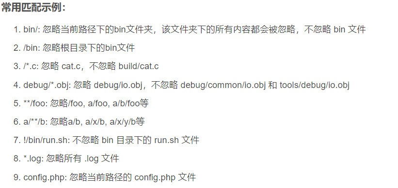

## Git是什么，有啥用

- 版本控制工具，==开源、免费、功能强大== 。其最重要的功能是为我们的工程建立一个**版本库**，我们可以从版本库中取**任意版本的文件**。
- 我们可以从分支上再**创建不同分支**，如从master主分支上创建dev开发分支等。可以将分支进行合并，如项目出现bug后，从master分支上创建debug分支，待修复完bug后，再合并到主分支，**完美符合软件开发流程**。
- 通过与远程仓库，如Gitee、GitHub配合使用，**打通代码从本地到云端的通路**，进入更广阔的代码世界。
- Git发展到现在，采用的是分布式版本控制的方案，即本地和中央服务器保存的都是版本库，**带有全部版本，包括自己提交的和别人提交的**。两者交换的也是版本库，**而不是某个版本**。
- **SVN**采用的是**集中式版本控制**的方案，中央服务器保存版本库，所有版本；本地只保存自己的版本，**每次都需要从中央服务器获取最新版本**。

***

## linux一些简单命令

- pwd 显示当前目录
- rm 删文件 rm -r 删文件夹 rm -rf 强制删除文件或文件夹
- mv 移动
- ls 显示当前文件夹下的内容
- touch 创建文件
- clear 清屏

***

## Git简单配置

- 首先，无论是查看配置还是修改配置的命令，都是在**操作Git配置文件**。因此，==完全可以写脚本来代替敲命令，完成对配置文件的修改==

- 查看配置
  - git config -l
  - git config --global --list
  - git config --system --list
- 修改配置
  - git config --global user.name "xxx"
  - git config --global user.email "xxx"

***

## 咋用

### 简单本地使用

- git status 显示文件状态

- git add .  将工作区文件全部提交到暂存区

- git commit --all -m "注释"    跳过git add,将工作区文件全部提交到版本库

- git commit -m “注释”  将暂存区文件提交到版本库

 ### gitignore

- 不需要添加到版本库里的文件，如.idea   target   

- *.txt 以txt结尾的文件

- ！lib.txt  不包括lib.txt

  

  

###  生成公钥，添加到Gitee

- 用于本机免密登录远程仓库

- 先命令行进入.ssh文件夹，一般在C:\Users\Administrator\.ssh

 >cd ~/.ssh

- 再生成公钥，使用rsa加密

 > ssh-keygen -t rsa

- 复制.ssh文件夹下的公钥文件的内容，添加到Gitee的SSH公钥

  

### IDEA使用内置Git

- 建立一个仓库，将本地IDEA工程与之关联

  - Gitee初始化一个仓库
  - 本地git clone这个仓库，选SSH链接
  - IDEA创建工程
  - 将克隆来的仓库直接复制到创建的IDEA工程中，实现覆盖

- 对本地工程进行版本控制，并推送到远程仓库
  - git add.
  - git commit -m "xxxx"
  - git push 

### Git 分支

- git branch 列出本地分支
- git branch -r 列出远程分支
- git checkout -b dev  创建dev分支，并切换到dev分支
- git branch dev  创建dev分支，不切换
- git merge dev  假设现在的分支是master，则合并dev到master，可能会产生冲突，需要自行选择哪一个版本
- git branch -d dev 删除dev分支

### 查看版本与回退

- git log -oneline  查看精简版日志
- git reflog 查看版本提交与回退记录
- git reset --hard Head~0 回退到上一个版本
- git reset --hard 版本号   回退到任一版本