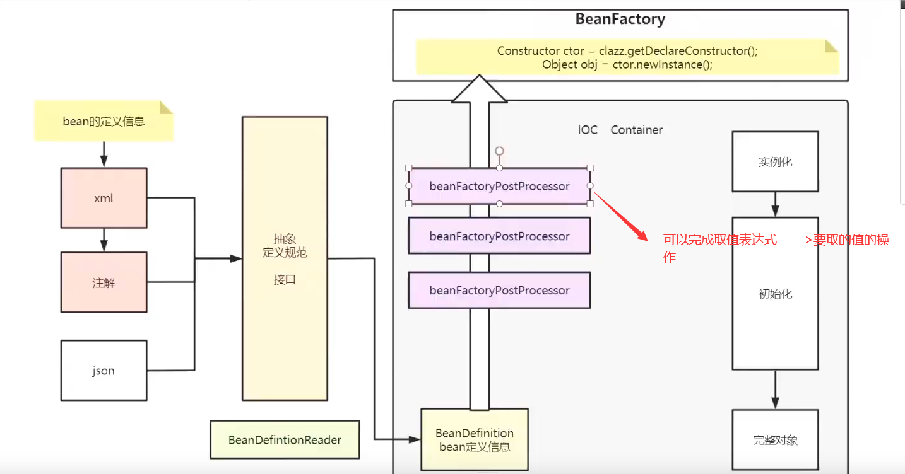

## spring源码解读

### Ioc容器

- 前置知识

  - **容器中的Bean都是通过反射创建的，默认都是单例的**。

    

    

    - 可以通过对象.getClass()获取Class对象
    - 需要获取构造器来创建对象。

  - **可以通过xml配置文件指定**Bean的定义信息
    - 

- Bean的实例化与初始化<init>

  

- BeanFactoryPostProcessor 完成对BeanFactory的功能扩展

  