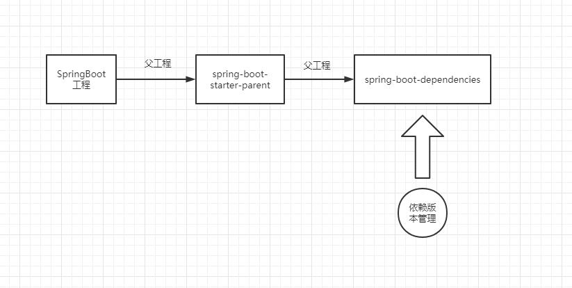
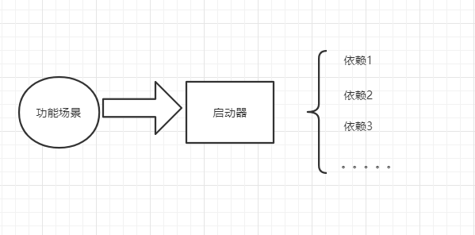
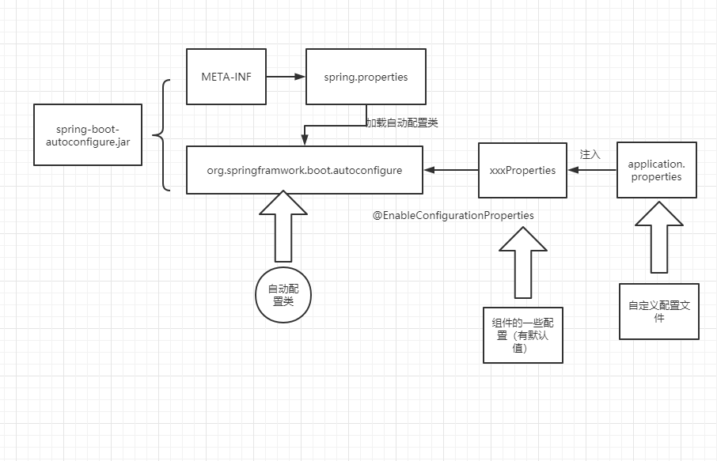
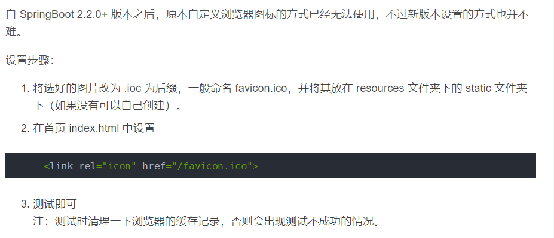

## 自动配置

- **向容器中自动装配组件**

- pom.xml

  

- starter场景启动器

  

- 自动配置原理

  

==各种starter的工作原理是什么？==

==执行启动类的main方法后，发生了什么？==

==**怎么通过注解将Properties中信息注入到自动配置类==？**

## Web开发

- 设置icon

  

### 使用thymeleaf开发

- 导入

  ```xml
  <dependency>
      <groupId>org.springframework.boot</groupId>
      <artifactId>spring-boot-starter-thymeleaf</artifactId>
  </dependency>
  ```

- 在template下写html页面
- 在controller中写跳转逻辑，即可实现发送请求、页面跳转
- 注意不能用@RestController，否则方法的返回值会被封装到响应体，无法被视图解析器解析。

**另一种方法**

- 不走controller层方法，直接使用视图控制器

  